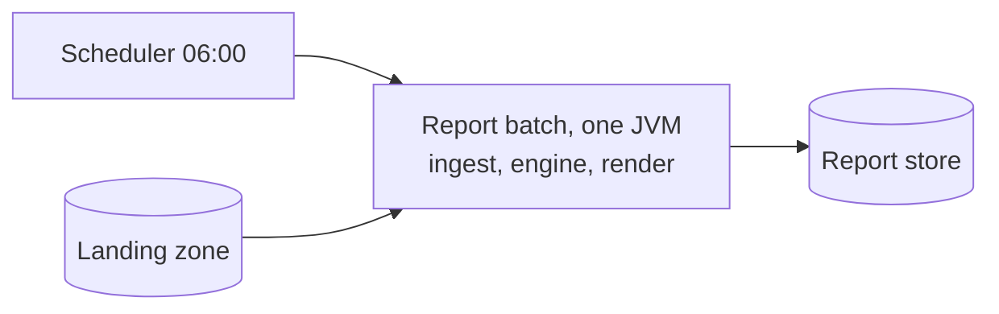
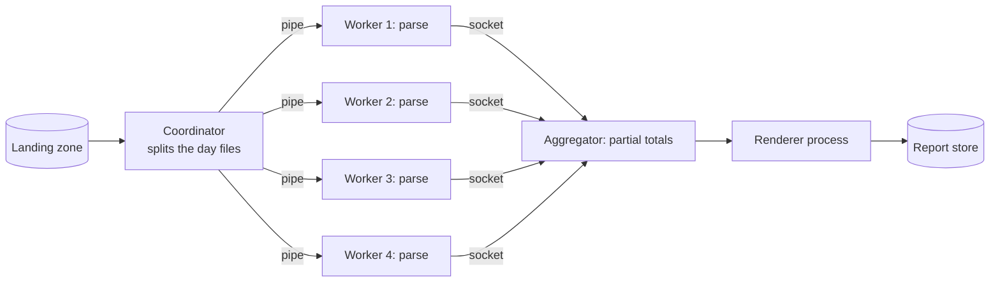
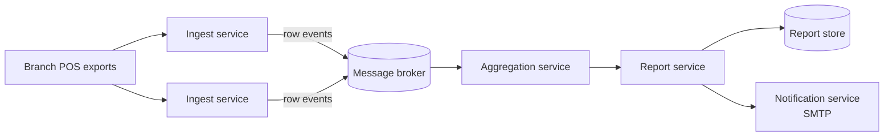

# ATAM-style evaluation: release 1 architecture

## Business drivers

- Report for month M on the morning of day 2 of M+1; about 3 M rows a month (brief).
- The chain will open more branches and head office wants the report earlier (the question that triggered this analysis).
- Branch links fail, so a missing file must not delay the other branches (QA-3).
- Constraints: the same developer team builds and runs the job with JDK 25 and Maven 3.9 (brief); there is no separate operations team or infrastructure budget (assumption, to confirm with the client).

## Candidates

### A: modular monolith batch (ADR-0001 today)

### B: process pipeline

### C: event-driven microservices

## Scenario analysis

| Scenario | A: modular monolith batch | B: process pipeline | C: microservices + broker |
| --- | --- | --- | --- |
| **QA-1** 3 M rows in 60 s | **++** because 8 parse threads in one heap finish in 4.9 s with no IPC or serialization on the path. | **+** because it also meets at 7.6 s, but pays 0.5 s of JVM start and 1.5 s of pipe serialization. | **−** because it only meets with tuned batching (5.9 s); at one event per receipt the broker alone takes 60 s. |
| **QA-2** 4th branch ≤ +35 % | **+** because 4 M rows cost 5.5 s, +13 % of 4.9 s — inside budget, but the 6th branch would breach it (+38 %). | **++** because a branch is one more worker slot; scaling is a config change, not a code change. | **++** because both brokers and consumers scale horizontally with the branch count. |
| **QA-3** REP file 2 h late, others out by 07:00 | **+** because one idempotent re-run recomputes everything from the file set in 5 s, but it re-parses all 3 M rows. | **0** because partial totals live in worker memory, so a late file forces the coordinator to replay the pipeline and reconcile state. | **++** because the broker buffers the late file and the aggregator folds it in without replaying the others. |
| **QA-4** new export format in 2 days | **++** because a new renderer touches three files: the class, `permits`, `forExtension`. | **+** because the renderer class is the same, but the pipe protocol and coordinator wiring change too. | **−** because a format means a new service or topic plus a deployment, far outside three files. |
| **QA-5** manager sees own branch only | **+** because there is one process and one choke point to enforce the branch filter. | **0** because four workers and a coordinator each re-implement the same policy, so there are five places to get it wrong. | **−** because every topic, credential and service becomes an attack surface and branch scoping must hold on the broker. |
| **QA-6** engine tests in 30 s | **++** because `mvn test` runs everything in 1.9 s with nothing external to start. | **0** because tests must spawn and supervise processes, which adds seconds and flakiness. | **−** because every test needs an embedded or test broker, which is slow and order-dependent. |
| **Cost and skills** | **++** because it needs only the JDK and Maven the team already has. | **0** because it stays plain Java, but adds a wire protocol, process supervision and partial-failure handling. | **−** because it needs a broker, its monitoring and deployment tooling nobody on the team has run before. |

## QA-1 estimates (assumptions first)

Assumptions — every number is an estimate to confirm with the client:

1. 3.0 M rows a month = 3 branches × 30 days × 33 000 rows (brief).
2. Parse and validate one row = **5 µs on one core** (split, convert, invariants, BigDecimal) → 3.0 M × 5 µs = **15.0 s serial**.
3. Aggregation merge = **2.0 s serial**; rendering three formats = **1.0 s serial** → serial tail 3.0 s; baseline T(1) = 18.0 s, parallel fraction p = 15/18 = **0.833**.
4. **8 cores**, parse scales linearly with workers (ideal; no memory contention).
5. Service/JVM start (B, C) = **0.5 s**, in parallel with reading files.
6. Pipe/socket IPC (B) = **0.5 µs/row** → 1.5 s total, spread over the workers.
7. Broker throughput = **50 000 messages/s** regardless of message size; producer serialization = 0.5 µs/row.
8. Landing zone on SSD; report output is four lines per format, so disk is not the bottleneck.

**A — one JVM, 8 parser threads.** Amdahl's law: S(n) = 1 / ((1 − p) + p/n), and T(n) = T_serial + T_parallel / n.

T_A = 2.0 + 1.0 + 15.0 / 8 = 3.0 + 1.875 = **4.875 ≈ 4.9 s** (S(8) = 3.69×; ceiling S(∞) = 1/(1−p) = 6.0×, so the floor is 3.0 s) → **meets ≤ 60 s with 12× margin**.

**B — coordinator + 4 workers over pipes.** Same law applied to the parse+IPC part:

T_B = 0.5 (start) + (15.0 + 1.5) / 4 (parse + IPC) + 2.0 + 1.0 = 0.5 + 4.125 + 3.0 = **7.625 ≈ 7.6 s** → **meets**.

**C — broker, two batch sizes.**

- One row per event: 3.0 M / 50 000 = **60.0 s of broker time alone** → 0.5 + 60.0 + 1.5 + 15/8 + 2 + 1 ≈ **66.9 s → fails QA-1**.
- 1000 rows per event: 3 000 messages / 50 000 = **0.06 s** broker; producers serialize 1 M rows each = 0.5 s (parallel); T_C = 0.5 + 0.5 + 0.06 + 15/8 + 2.0 + 1.0 = **5.935 ≈ 5.9 s → meets, but only while every producer batches**.

## Sensitivity points

- **S1 — parse parallelism n (A).** Amdahl with p = 0.833: 6.75 s at n = 4, 4.9 s at n = 8, 3.9 s at n = 16, floor 3.0 s at n → ∞. Direction: more cores ⇒ less run time, but past n ≈ 8 the gain is under 20 %, so buying cores cannot buy an *earlier* report indefinitely (**QA-1, QA-2**).
- **S2 — number of branches / rows (A).** 4 branches = 5.5 s (+13 %), 5 branches = 6.1 s (+26 %), 6 branches = 6.75 s (**+38 %, breaches QA-2**). Direction: run time grows ~linearly with rows, so the +35 % budget holds to five branches on the current box (**QA-2, QA-1**).
- **S3 — event batch size (C).** Broker time swings from 60.0 s at 1 row/event to 0.06 s at 1000 rows/event — **three orders of magnitude**. Direction: bigger batches ⇒ faster QA-1 but each message carries more rows, so a late file waits for a fuller batch and QA-3's 07:00 merge gets slower (**QA-1 against QA-3**).

## Trade-off points

- **T1 — broker between ingest and aggregation.** Buffers late and out-of-order files (**+QA-3**) but adds a network hop, serialization and an operated component (**−QA-1, −cost, −QA-5 attack surface**).
- **T2 — heap partitioned across parse workers instead of one shared heap.** More workers finish parsing sooner (**+QA-1**) but each holds its own slice of 3 M `SaleTransaction` objects, so a peak reduces the shared headroom and a single OOM takes the whole batch down (**−QA-3**).
- **T3 — publishing a partial report at 07:00 instead of waiting for the late branch.** Head office always meets the deadline (**+QA-3**) but the finance director may sign off figures that later move (**−QA-5**).

## Risks, non-risks, risk themes

**Theme 1 — "the report must exist on the morning of day 2"** (business driver: head office's deadline).

- **R1:** the 3.0 s serial tail was measured on four output lines; real anomaly detection (3σ per branch) and the top-10 sort over 3 M rows are not in it — if the tail becomes 15 s, A's floor quadruples (**QA-1**).
- **R2:** a branch link that is down all night means the 06:45 cut-off finds nothing; head office receives a partial report and may treat it as final (**QA-3, QA-5**).
- **Non-risk NR1:** volume is not the threat — A runs 3 M rows in 4.9 s against a 60 s budget, and even a 10× month costs 3 + 150/8 ≈ 21.8 s (**QA-1**).

**Theme 2 — "more branches, no operations team"** (business driver: the chain grows).

- **R3:** the sixth branch pushes A to +38 % on the same 8-core box, outside QA-2's +35 %, and the fix (more cores or partitioning) is not in the current design (**QA-2**).
- **R4:** choosing C would put a broker on the critical path with nobody who has ever operated one — an unowned component at 06:00 (**cost, QA-5**).
- **Non-risk NR2:** the fourth branch costs +13 % (5.5 s), comfortably inside QA-2's +35 % (**QA-2**).
- **Non-risk NR3:** the test suite already runs in **1.9 s** (measured, `mvn test` total) against QA-6's 30 s, and A needs no external services to start (**QA-6**).

## Recommendation

**Confirm ADR-0001 — release 1 stays a modular monolith batch (candidate A). No ADR-0003.**

The table decides it: **A never drops below `+`** — 4 × `++` (QA-1, QA-4, QA-6, cost and skills) and 3 × `+` (QA-2, QA-3, QA-5) — while B never drops below `0` but is `++` only on QA-2 and buys that with four `0`s (QA-3, QA-5, QA-6, cost). C is genuinely `++` on QA-2 and QA-3, but pays for it with `−` in five cells (QA-1 only meets while every producer batches, QA-4, QA-5, QA-6, cost and skills) — four hard requirements traded away for two we already meet. B's only win is QA-2, and A already satisfies it: a fourth branch costs +13 % against a +35 % budget.

On the question asked: **more branches do not overturn ADR-0001** — A holds to five branches inside QA-2's budget (S2) and an earlier report is available by starting the same batch earlier, since its floor is 3.0 s (S1), not by changing style. What would overturn it is a demand for *intraday* or continuously refreshed reports: then the nightly batch assumption itself breaks, and the next candidate is **B**, not C — it keeps QA-4 and QA-6 while adding replay.

Revisit when: a sixth branch is planned, one run on the 8-core server passes 45 s, or head office asks for intraday figures.
