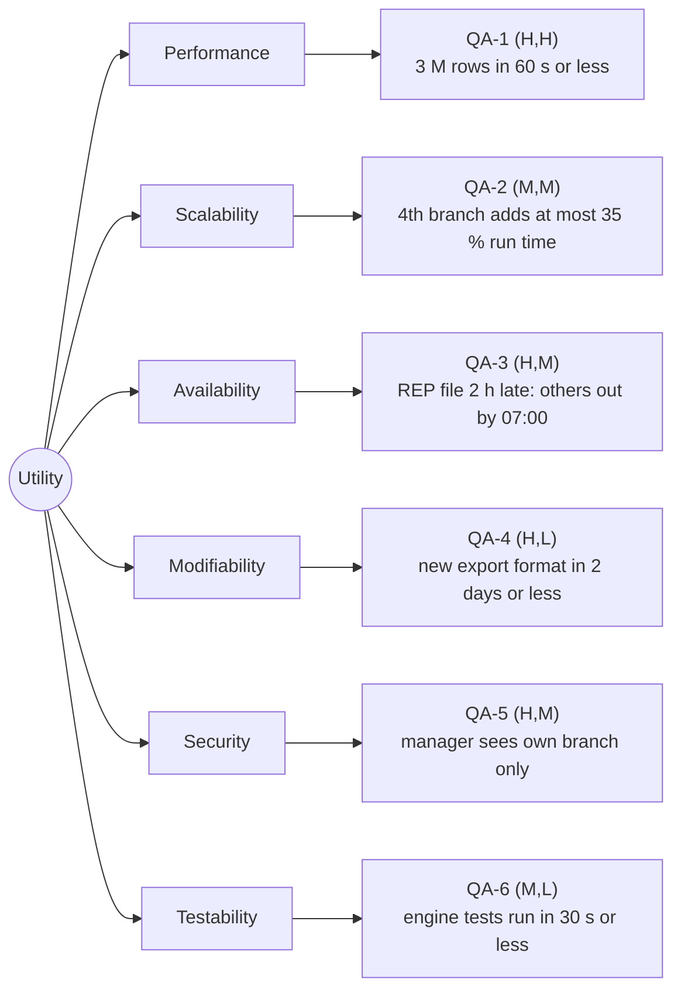

# Quality-attribute scenarios: Angkor Mart monthly sales report

## Stakeholders

- Head-office analyst: opens the report for a month and all three branches, compares figures, exports PDF/Excel; needs the numbers to be right and early.
- Branch manager (PNH, REP, BTB): logs in on day 2 and looks only at their own branch's page; must never see another branch's figures.
- Finance director: wants to be told the moment the report is ready, and signs off on the totals.
- Operations person who runs the job: schedules the batch at 06:00 on day 2, watches the progress, re-runs it when a branch file is late or a link is down.
- Our team (developers): has to build, test and change this system all semester with a small team and a fixed lab schedule.

## Scenarios

| ID   | Attribute     | Source                                      | Stimulus                                                                 | Artifact                                   | Environment                                                     | Response                                                                                                  | Response measure                                                                                                                                                              | Rank  |
| ---- | ------------- | ------------------------------------------- | ------------------------------------------------------------------------ | ------------------------------------------ | --------------------------------------------------------------- | --------------------------------------------------------------------------------------------------------- | ----------------------------------------------------------------------------------------------------------------------------------------------------------------------------- | ----- |
| QA-1 | Performance   | Scheduler, 06:00 on day 2 of M+1            | Starts the report for a month of about 3 M rows                          | Report engine                              | Normal operation, 8-core server, all branch files complete      | Report files written (txt, html, csv) and the "ready" event published                                       | <= 60 s wall-clock, median of 5 runs after 2 warm-up runs, measured with System.nanoTime() around load + aggregate + render                                                       | (H,H) |
| QA-2 | Scalability   | Operations person, when a 4th branch (KMP) opens | Adds one more branch with the same daily volume (~33 000 rows/day)    | Report engine (ingest + aggregation)      | Normal operation, same 8-core server, 4 complete file sets      | Report still produced correctly; runtime grows sub-linearly, not one-for-one                                | Run time for 4 branches <= 135 % of the 3-branch baseline (at most +35 %), median of 5 runs after 2 warm-up runs                                                              | (M,M) |
| QA-3 | Availability  | Branch link failure: REP upload, 2 h late    | The REP file for day 1 is missing when the batch starts at 06:00        | Report batch and report store              | Degraded operation: 2 of 3 branch file sets present             | Partial report for PNH and BTB published, REP marked pending; after the file arrives a re-run replaces it    | PNH+BTB report on disk by 07:00 (<= 60 min after start); re-run after the late file finishes <= 60 s and is byte-identical to a from-scratch run (no duplicate rows)          | (H,M) |
| QA-4 | Modifiability | Head-office analyst asks for Excel (XLSX) output | Add one new output format for the existing MonthlyReport              | render package (ReportRenderer hierarchy)  | Normal development, no change allowed to model or ingest        | New renderer implemented, tested and selected by forExtension("xlsx") without touching other packages        | <= 2 person-days of effort; <= 3 files changed outside the new renderer class; mvn -q verify exits 0                                                                          | (H,L) |
| QA-5 | Security      | Branch manager, logged in as REP            | Requests the PNH report (another branch's figures)                      | Report store and user interfaces           | Normal operation, authenticated session                         | Request refused, nothing from PNH returned, attempt written to the audit log                                | 100 % of 50 scripted cross-branch requests blocked (0 leaks); denial answered in <= 500 ms; 100 % of denials logged with user, branch, timestamp                              | (H,M) |
| QA-6 | Testability   | Developer, before every commit              | Runs the automated test suite of the engine                              | Test suite over model, ingest and render   | Clean clone on a developer laptop or the CI runner              | Tests execute, a failure names the input line and the field, seeded defect caught                           | Full suite <= 30 s wall-clock; >= 80 % line coverage of model + ingest + render; a seeded bad row is caught by >= 1 test in 10 of 10 runs                                     | (M,L) |

## Rank justifications

- QA-1 (H,H): the report is due on the morning of day 2 and 3 M rows with BigDecimal are genuinely expensive, so both the business and the architecture care a lot.
- QA-2 (M,M): a 4th branch is only a "when", not an "if", but doubling volume stresses the same pipeline QA-1 already forces us to build, so the difficulty is moderate.
- QA-3 (H,M): branch links fail now and then (brief), the deadline is fixed, so the business impact is high while the design work (partial report + idempotent re-run) is real but contained.
- QA-4 (H,L): head office explicitly wants PDF and Excel, so importance is high, but a sealed Strategy hierarchy already isolates the change to one new class, making it cheap.
- QA-5 (H,M): branch managers must see their own branch only (brief) and a leak would be a trust disaster, while the enforcement sits at one choke point but must hold in every UI.
- QA-6 (M,L): fast tests protect the whole semester's work, but JUnit gives us the harness for free and the packages are already small and isolated.

## Assumptions

- A1: the report server has 8 cores and an SSD (to confirm with the client).
- A2: all branch files for day M are complete and on disk by 06:00 on day 2 of M+1, except in QA-3 where the REP file is deliberately 2 h late.
- A3: "about 3 M rows" = 3 branches x 30 days x 33 000 rows; the lab sample is only 3 000 rows, so QA-1 is measured on a generated full-volume month.
- A4: a 4th branch has the same daily volume and the same file format as PNH, REP and BTB.
- A5: the batch starts at 06:00 and head office's deadline is the morning of day 2; 07:00 is the agreed partial-report cut-off for QA-3.
- A6: PDF and XLSX renderers arrive in Lab-08; QA-4 is measured on a renderer added to the same sealed hierarchy.
- A7: branch managers have exactly one account, scoped to one branch code; QA-5 is measured against scripted HTTP requests, not a penetration test.
- A8: timings use wall-clock seconds on one machine, median of 5 runs after 2 warm-up runs, same heap and no other load.
- A9: "lines changed" and "person-days" are counted from git history and our own time sheet.

## Utility tree

## Architectural drivers

QA-1, QA-3, QA-5 — the (H,H) and (H,M) leaves. These three decide the architecture: QA-1 forces a parallel, streaming ingest/aggregation pipeline instead of a naive row-by-row loop; QA-3 forces idempotent re-runs keyed on `BRANCH-yyyy-MM-dd.csv` plus a partial-report policy; QA-5 forces a single authorization choke point that every renderer and UI must pass through. QA-2 and QA-4 are served by the same choices, QA-6 is free once the packages stay decoupled.
